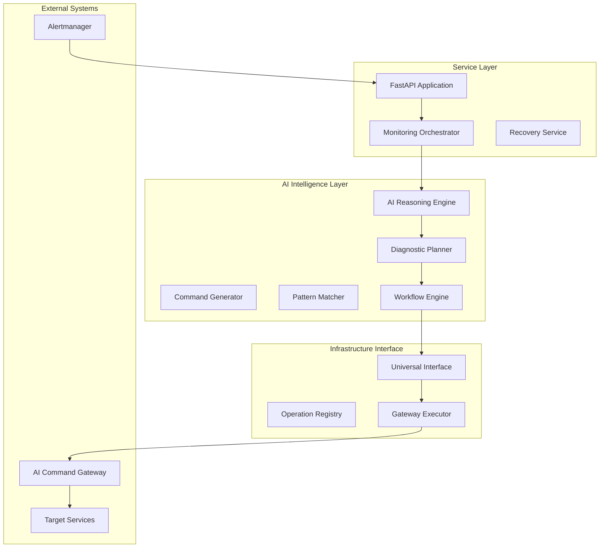

# DevOps AI Agent - Intelligent Infrastructure Management System

## 🎯 Overview

The **DevOps AI Agent** is an advanced AI-powered infrastructure management and automation system. Built with FastAPI and powered by sophisticated AI intelligence, it provides autonomous monitoring, diagnosis, and recovery capabilities for containerized environments.

### Core Purpose:
- **Intelligent Monitoring**: AI-driven infrastructure health monitoring and analysis
- **Autonomous Recovery**: Automated issue detection and resolution
- **Event-Driven Operations**: Real-time response to infrastructure alerts
- **Multi-Environment Support**: Universal operations across different infrastructure environments
- **AI-Powered Diagnostics**: Advanced diagnostic planning and execution workflows

### Key Capabilities:
```
Alert Detection → AI Analysis → Diagnostic Planning → Automated Recovery
      ↓              ↓                ↓                    ↓
  Alertmanager  → LLM Reasoning → Multi-Phase Plans → Gateway Execution
      ↓              ↓                ↓                    ↓
Real-time Alerts → Root Cause → Smart Workflows → Infrastructure Actions
```

The DevOps AI Agent serves as an **intelligent infrastructure orchestrator** that combines real-time monitoring with advanced AI reasoning to maintain system health autonomously.

---

## 🚀 Quick Start

### Prerequisites
- Python 3.8+
- Docker and Docker Compose
- OpenAI API Key (for AI capabilities)
- Access to target infrastructure (containers, services)

### Installation

```bash
# Clone and setup
cd devops-ai-agent

# Create virtual environment
python -m venv venv
source venv/bin/activate  # On Windows: venv\Scripts\activate

# Install dependencies
pip install -r requirements.txt

# Configure environment
cp .env.example .env
# Edit .env with your configuration
```

### Configuration

Create a `.env` file in the repository root:

```bash
# Core Configuration
ENVIRONMENT=development
LOG_LEVEL=DEBUG
SERVICE_NAME=devops-ai-agent
SERVICE_VERSION=1.0.0
API_PORT=8001

# AI Intelligence (Required)
OPENAI_API_KEY=your_openai_api_key_here
LLM_MODEL=gpt-4
LLM_TEMPERATURE=0.1
LLM_MAX_TOKENS=2000
LLM_TIMEOUT=60

# Operation Control
SAFETY_MODE=true
FALLBACK_ENABLED=true
MONITORING_INTERVAL=30

# Target Services
MARKET_PREDICTOR_URL=http://localhost:8000

# Infrastructure Access
# Configure according to your infrastructure setup
```

### Running the Service

```bash
# Development mode
python -m uvicorn src.agent.main:app --reload --host 0.0.0.0 --port 8001

# Or using Docker
docker-compose up --build
```

### Verification

Once running, verify the service:

- **API Documentation**: http://localhost:8001/docs
- **Health Check**: http://localhost:8001/health
- **System Status**: http://localhost:8001/status

---

## 📊 Architecture

### Core Components



### AI Intelligence Engine

The system includes five AI intelligence components:

1. **AI Reasoning Engine**: Core LLM-powered analysis and decision making
2. **Diagnostic Planner**: Creates intelligent multi-phase diagnostic workflows
3. **Command Generator**: Generates custom commands beyond predefined operations
4. **Pattern Matcher**: Learns from past incidents and recognizes patterns
5. **Workflow Engine**: Executes complex diagnostic workflows with adaptive logic

### Universal Infrastructure Interface

Environment-agnostic operations layer supporting:
- **Operation Registry**: Centralized catalog of available infrastructure operations
- **Gateway Executor**: AI Command Gateway integration for natural language operations
- **Multi-Environment**: Supports different infrastructure environments
- **Intelligent Routing**: AI-driven operation selection and execution

---

## 📡 API Endpoints

### Health & Status
- `GET /health` - Basic health check
- `GET /status` - Detailed system status including AI components
- `GET /monitoring/status` - Monitoring system status

### Agent Control
- `POST /control/start-monitoring` - Start continuous monitoring
- `POST /control/stop-monitoring` - Stop monitoring
- `POST /monitoring/cycle` - Trigger single monitoring cycle

### Event Processing
- `POST /webhook/alerts` - Receive Alertmanager webhooks (primary event trigger)

### Debug & Diagnostics
- `GET /debug/docker` - Docker connectivity diagnostics
- `GET /orchestrator/status` - Recovery action history

### Documentation
- `GET /docs` - Interactive API documentation (Swagger UI)
- `GET /redoc` - Alternative API documentation

---

## 🤖 AI Intelligence Features

### Advanced AI Reasoning
- **LLM-Powered Analysis**: Uses GPT-4 for intelligent issue analysis
- **Context-Aware Decisions**: Considers full system context for decisions
- **Root Cause Analysis**: Deep investigation beyond surface symptoms
- **Risk Assessment**: Evaluates risks before taking actions
- **Confidence Scoring**: Provides confidence levels for autonomous actions

### Diagnostic Planning
- **Multi-Phase Workflows**: Complex diagnostic plans with intelligent step chaining
- **Adaptive Execution**: Dynamic workflow adjustment based on results
- **Success Criteria**: Clear validation for each diagnostic step
- **Escalation Logic**: Automatic escalation when AI confidence is low

### Pattern Recognition
- **Incident Learning**: Learns from past incidents and outcomes
- **Pattern Matching**: Recognizes similar issues for faster resolution
- **Historical Context**: Uses past data to inform current decisions
- **Continuous Improvement**: Evolves capabilities based on experience

---

## 🔧 Core Operations

### Infrastructure Operations
The system supports the following core operations through the Universal Interface:

1. **Service Management**
   - `restart_service` - Intelligent service restart with validation
   - `scale_service` - Service scaling operations
   - `health_check` - Comprehensive health verification

2. **Monitoring & Diagnostics**
   - `get_logs` - Intelligent log retrieval and analysis
   - `check_resources` - Resource monitoring and analysis
   - `execute_command` - Custom command execution with context

3. **AI-Enhanced Operations**
   - Context-enriched operation execution
   - Natural language operation descriptions
   - Intelligent parameter selection
   - Results analysis and validation

### Operation Flow
```
Alert Received → AI Analysis → Diagnostic Plan → Operation Execution → Validation → Learning
```

---

## 🛡️ Safety & Security

### Built-in Safety Controls
- **Safety Mode**: Human approval required for all automated actions
- **Confidence Thresholds**: Actions only taken when AI confidence is sufficient
- **Escalation Protocols**: Automatic human escalation for complex issues
- **Operation Validation**: All actions validated before and after execution
- **Rollback Capabilities**: Ability to undo actions when possible

### Security Features
- **API Key Management**: Secure handling of external API credentials
- **Input Validation**: Comprehensive validation of all inputs and parameters
- **Audit Trail**: Complete logging of all agent activities and decisions
- **Error Handling**: Graceful handling of failures with secure error messages
- **Rate Limiting**: Protection against API abuse and excessive operations

### Fail-Safe Mechanisms
- **AI Fallback**: Rule-based fallback when AI systems fail
- **Circuit Breaker**: Protection against repeated failures
- **Timeout Controls**: Prevents operations from running indefinitely
- **Resource Limits**: Prevents resource exhaustion

---

## 🔌 Integration

### Alertmanager Integration
- **Webhook Reception**: Receives real-time alerts from Prometheus Alertmanager
- **Alert Processing**: Intelligent parsing and analysis of alert metadata
- **Severity Routing**: Different response strategies based on alert severity
- **Alert Correlation**: Links related alerts for comprehensive analysis

### AI Command Gateway
- **Natural Language Operations**: Expresses infrastructure operations as human-readable intents
- **AI-to-AI Communication**: Intelligent communication between AI services
- **Enhanced Context**: Rich operational context for better AI decision making
- **Unified Interface**: Single interface for multiple infrastructure environments

### Target Service Monitoring
- **Health Monitoring**: Continuous monitoring of target service health
- **Performance Tracking**: Response time and availability monitoring
- **Error Detection**: Intelligent detection of service issues
- **Recovery Validation**: Verification that recovery actions were successful

---

## 🏗️ Development

### Project Structure
```
devops-ai-agent/
├── src/
│   └── agent/
│       ├── main.py                    # FastAPI application
│       ├── core/                      # Core system components
│       │   ├── ai_reasoning.py        # AI analysis engine
│       │   ├── ai_executor.py         # AI action execution
│       │   ├── universal_interface.py # Infrastructure operations
│       │   ├── monitoring.py          # Monitoring orchestration
│       │   └── ai_intelligence/       # AI intelligence components
│       ├── agents/                    # LangChain analysis agents
│       ├── services/                  # External service clients
│       ├── models/                    # Data models and schemas
│       ├── config/                    # Configuration management
│       └── api/                       # API endpoints
├── tests/                             # Test suite
├── requirements.txt                   # Dependencies
└── .env.example                      # Environment template
```

### Testing
```bash
# Install development dependencies
pip install -r requirements-dev.txt

# Run tests
pytest tests/ -v

# Run with coverage
pytest tests/ --cov=src/agent --cov-report=html

# Code quality
flake8 src/ tests/
black src/ tests/
mypy src/
```

### Configuration Management
The system uses environment-based configuration with strict validation:
- **No Default Values**: All required settings must be explicitly configured
- **Fail-Fast**: System fails immediately if required configuration is missing
- **Type Validation**: Automatic validation of configuration types and values
- **Security**: Sensitive values (API keys) are handled securely

---

## 🤝 Contributing

### Development Guidelines
1. **Maintain AI Intelligence**: Ensure all automated operations maintain AI-driven decision making
2. **Safety First**: Include appropriate safety checks for all new automated capabilities
3. **Comprehensive Testing**: Add tests for all new AI intelligence features
4. **Documentation**: Update documentation for any new AI capabilities or operations
5. **Security**: Follow security best practices for API integrations and data handling

### Code Standards
- Follow Python PEP 8 style guidelines
- Use type hints for all functions and methods
- Include comprehensive docstrings for AI intelligence components
- Add logging for all AI decisions and infrastructure operations
- Implement proper error handling and escalation

---

## 📝 License

MIT License - Part of the Autonomous Trading Builder system.

---

*🤖 The DevOps AI Agent represents advanced autonomous infrastructure management - an intelligent system that can monitor, diagnose, and recover from infrastructure issues with minimal human intervention. It combines cutting-edge AI reasoning with practical DevOps operations to create truly self-managing infrastructure.*